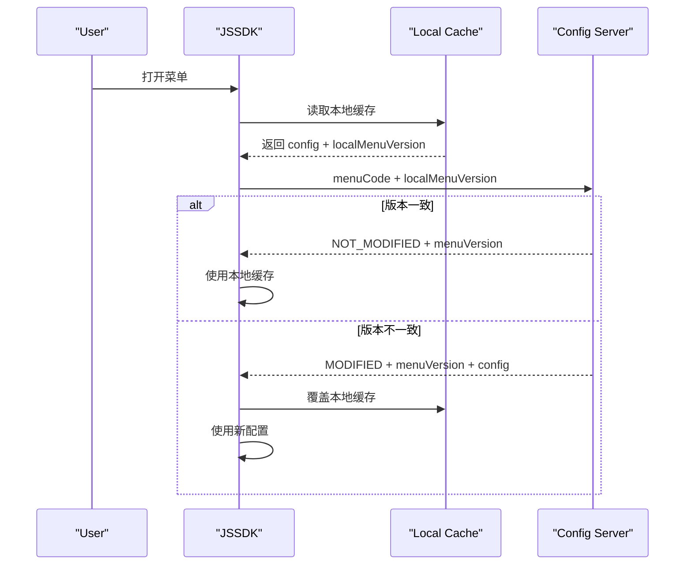
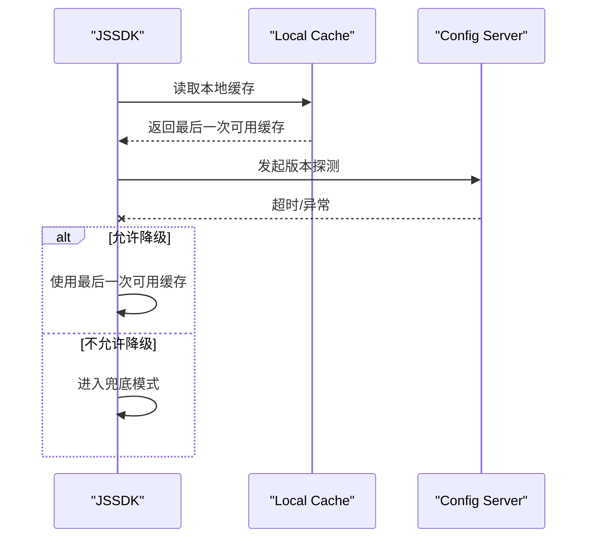

# JSSDK 缓存方案详细设计（菜单级版本号方案）

> 版本：v2.2  
> 日期：2026-03-18  
> 文档定位：技术经理评审稿 / 研发落地稿  
> 适用范围：开阳系统菜单打开链路中的 JSSDK 页面运行时配置加载

## 1. 文档目标

本文用于明确 JSSDK 缓存方案 `V1` 的主设计，重点回答：

1. 服务端维护什么。
2. JSSDK 本地缓存什么。
3. 菜单变更后如何统一失效。
4. 重复进入菜单时如何减少重复拉取。

本次确认后的主方向为：

`菜单级版本号 + 服务端现查配置 + JSSDK 本地缓存 + 版本不一致时统一重拉`

## 2. 背景

当前菜单打开链路如下：

`打开菜单 -> 注入 JSSDK -> iframe 内 JSSDK 初始化 -> 从服务端加载页面运行时配置 -> JSSDK ready`

当前问题：

1. 每次进入菜单都需要重新拉取页面运行时配置。
2. 重复进入同一菜单时，等待时间偏长。
3. 网络波动时，配置加载耗时不稳定。
4. 若版本体系按过细维度拆分，治理复杂度会明显上升。

## 3. 设计结论

### 3.1 V1 主方案

`V1` 采用以下方案：

1. 服务端只维护菜单级版本号 `menuVersion`。
2. 菜单相关配置一旦发生生效变更，就统一升级 `menuVersion`。
3. JSSDK 初始化时上报本地 `menuVersion`。
4. 服务端只判断版本是否一致。
5. 版本一致时，JSSDK 直接使用本地缓存配置。
6. 版本不一致时，服务端现查当前配置并返回完整内容。
7. JSSDK 用返回的新配置覆盖本地缓存。

### 3.2 当前阶段不采用的方案

`V1` 不采用以下方案作为主实现：

1. 多维度版本号体系。
2. 发布后运行时快照落库作为当前阶段主链路。
3. 浏览器 `IndexedDB` 作为生产主缓存方案说明主体。
4. 命中缓存后完全不做服务端版本探测。

### 3.3 方案定位

该方案本质上是：

`版本探测 + 本地复用 + 版本不一致时现查配置`

它优先解决：

1. 版本模型过碎的问题。
2. 重复进入菜单时的重复拉取问题。
3. 关键生产系统先稳定上线的问题。

## 4. 设计原则

1. 稳定性优先：不能因为缓存引入白屏、卡死、长时间无响应。
2. 版本模型优先简单：先收敛到菜单级版本号。
3. 主流程可降级：缓存异常不能阻塞主流程。
4. 术语尽量贴近实现：主文档不展开页面内缓存分层术语。
5. 保留演进空间：后续如配置装配过重，可演进到快照模式。

## 5. 核心概念

### 5.1 menuVersion

`menuVersion` 是服务端维护的菜单级配置版本号，表示：

1. 某菜单当前生效配置集合的逻辑版本。
2. 菜单下任一影响 JSSDK 运行结果的配置发生生效变更时，需要升级。
3. 不按机构单独维护，不按角色单独维护。

### 5.2 本地缓存

JSSDK 本地缓存保存的是：

1. 当前菜单对应的完整运行时配置。
2. 该配置对应的 `menuVersion`。
3. 生成时间、过期时间等辅助字段。

## 6. 为什么不做更细的版本维度

如果版本号按过细维度维护，会产生以下问题：

1. 版本数量迅速膨胀。
2. 变更链路和发布链路变复杂。
3. 排障时很难快速判断到底哪个版本生效。
4. 服务端和前端都要处理大量碎片化版本。

因此本方案明确：

1. 版本只按菜单维护。
2. 当前主文档不展开更细粒度的缓存隔离方案。

## 7. 整体架构

本方案只保留两层关键概念：

1. `JSSDK 本地缓存`
2. `服务端版本探测 + 配置现查`

职责如下：

`JSSDK 本地缓存`

1. 提供重复进入同一菜单时的本地复用。
2. 作为版本一致时直接使用的配置来源。

`服务端版本探测 + 配置现查`

1. 负责返回当前 `menuVersion` 是否发生变化。
2. 版本不一致时，负责现查并返回当前完整配置。

## 8. menuVersion 设计

### 8.1 定义

`menuVersion` 建议使用递增整数或可排序字符串。

### 8.2 升级时机

以下任一场景生效时，应升级 `menuVersion`：

1. 菜单下页面运行时配置变更并生效。
2. 菜单下规则、提示、作业、接口绑定等影响运行结果的配置变更并生效。
3. 菜单配置结构发生不兼容升级。

### 8.3 不升级的场景

以下场景原则上不应升级 `menuVersion`：

1. 仅修改描述性文案且不影响 JSSDK 运行。
2. 审计字段、更新时间等非运行逻辑字段变化。

### 8.4 建议格式

推荐优先采用简单整型自增：

```text
1, 2, 3, 4 ...
```

优点：

1. 前后端理解最简单。
2. 业务和技术都容易解释。
3. 排障成本最低。

## 9. 服务端职责

服务端在 `V1` 只承担两件事：

1. 返回当前菜单最新 `menuVersion`
2. 在版本不一致时现查并返回当前完整配置

明确不做：

1. 不强制要求维护运行时快照表。
2. 不强制要求维护 `etag`。
3. 不强制要求维护复杂的多维版本号体系。

## 10. JSSDK 职责

JSSDK 在 `V1` 承担以下职责：

1. 读取当前菜单上下文。
2. 读取本地缓存及本地 `menuVersion`。
3. 请求服务端做版本探测。
4. 若版本一致，直接使用本地缓存。
5. 若版本不一致，使用服务端返回的新配置覆盖本地缓存。
6. 在异常情况下按策略决定是否降级使用最后一次可用缓存。

## 11. 接口设计

### 11.1 接口职责

服务端提供一个版本探测接口：

1. 接收当前菜单标识。
2. 接收客户端本地版本号。
3. 判断是否需要重新拉取。
4. 如需重新拉取，直接返回现查后的完整配置。

### 11.2 推荐接口

```http
POST /api/runtime/menu-config/check
Content-Type: application/json
```

### 11.3 请求体示例

```json
{
  "traceId": "7c3d4f2a11b24999",
  "menuCode": "loan-apply",
  "localMenuVersion": 12,
  "schemaVersion": 1,
  "sdkVersion": "1.3.0"
}
```

### 11.4 请求字段定义

| 字段 | 类型 | 必填 | 说明 |
| --- | --- | --- | --- |
| `traceId` | string | 是 | 链路追踪 ID |
| `menuCode` | string | 是 | 菜单编码 |
| `localMenuVersion` | number | 否 | 客户端当前本地版本 |
| `schemaVersion` | number | 是 | JSSDK 配置协议版本 |
| `sdkVersion` | string | 是 | JSSDK 当前版本 |

### 11.5 请求校验规则

1. `menuCode` 缺失直接返回参数错误。
2. `schemaVersion` 缺失直接返回参数错误。
3. `localMenuVersion` 缺失视为首次进入。

### 11.6 版本一致响应示例

```json
{
  "traceId": "7c3d4f2a11b24999",
  "result": "NOT_MODIFIED",
  "menuVersion": 12,
  "degradeEnabled": true,
  "expireAt": "2026-03-18T18:00:00+08:00"
}
```

### 11.7 版本不一致响应示例

```json
{
  "traceId": "7c3d4f2a11b24999",
  "result": "MODIFIED",
  "menuVersion": 13,
  "degradeEnabled": true,
  "expireAt": "2026-03-18T18:00:00+08:00",
  "config": {
    "page": {},
    "rules": [],
    "prompts": [],
    "jobs": [],
    "interfaces": []
  }
}
```

### 11.8 响应字段定义

| 字段 | 类型 | 必返 | 说明 |
| --- | --- | --- | --- |
| `traceId` | string | 是 | 回传链路 ID |
| `result` | string | 是 | 判定结果 |
| `menuVersion` | number | 是 | 服务端当前菜单版本 |
| `degradeEnabled` | boolean | 是 | 是否允许异常时使用最后一次可用缓存 |
| `expireAt` | string | 否 | 本地缓存建议失效时间 |
| `config` | object | 条件必返 | 仅在版本不一致或首次进入时返回 |

### 11.9 结果枚举

1. `NOT_MODIFIED`：本地缓存可继续使用
2. `MODIFIED`：本地缓存不可复用，需使用新配置
3. `NO_LOCAL_VERSION`：客户端无本地版本，服务端返回完整配置
4. `INCOMPATIBLE_SCHEMA`：协议不兼容，服务端返回完整配置

### 11.10 错误码建议

| 错误码 | 含义 | 客户端动作 |
| --- | --- | --- |
| `CC-MENUCFG-4001` | 参数缺失 | 记录错误并走兜底 |
| `CC-MENUCFG-4002` | `schemaVersion` 非法 | 重新拉取并上报 |
| `CC-MENUCFG-4041` | 菜单无生效配置 | 空配置兜底或提示 |
| `CC-MENUCFG-5001` | 配置查询失败 | 若允许降级则使用最后一次可用缓存 |
| `CC-MENUCFG-5002` | 配置装配失败 | 若允许降级则使用最后一次可用缓存 |

## 12. 主链路设计

### 12.1 主链路

1. JSSDK 初始化。
2. 获取当前菜单 `menuCode`。
3. 读取本地缓存。
4. 拿到本地 `menuVersion` 后请求服务端。
5. 若服务端返回 `NOT_MODIFIED`，直接使用本地缓存配置。
6. 若服务端返回 `MODIFIED/NO_LOCAL_VERSION/INCOMPATIBLE_SCHEMA`，使用服务端现查返回的新配置。
7. 用新配置更新本地缓存。
8. JSSDK 进入 ready。

### 12.2 主链路时序图



### 12.3 首次进入菜单

首次进入通常没有本地缓存：

1. 客户端不带 `localMenuVersion`。
2. 服务端直接返回当前 `menuVersion` 和完整配置。
3. JSSDK 写入本地缓存。

### 12.4 重复进入菜单

重复进入菜单时的收益主要来自：

1. 版本一致时不再重复下发大配置。
2. JSSDK 直接使用本地缓存完成初始化。
3. 网络波动时更容易保持稳定体验。

## 13. 服务端现查逻辑

### 13.1 服务端处理顺序

服务端建议按以下顺序处理：

1. 校验请求参数。
2. 查询当前菜单最新 `menuVersion`。
3. 比较客户端本地版本。
4. 若版本一致，直接返回 `NOT_MODIFIED`。
5. 若版本不一致，现查当前菜单完整配置。
6. 返回 `menuVersion + 完整配置`。

### 13.2 服务端伪代码

```java
MenuConfigCheckResponse check(MenuConfigCheckRequest req) {
    validateRequest(req);

    int currentVersion = menuVersionService.getCurrentVersion(req.getMenuCode());

    if (req.getLocalMenuVersion() != null && req.getLocalMenuVersion() == currentVersion) {
        return MenuConfigCheckResponse.notModified(currentVersion);
    }

    RuntimeConfig config = runtimeConfigService.loadCurrentConfig(
        req.getMenuCode(),
        req.getSchemaVersion()
    );

    return MenuConfigCheckResponse.modified(currentVersion, config);
}
```

### 13.3 现查配置的前提要求

该方案成立的前提是：

1. 服务端现查配置的耗时可控。
2. 配置装配逻辑稳定，不会随机波动。
3. 当前生效配置可稳定复现。
4. 配置来源不要过于分散。

### 13.4 该方案的边界

该方案的弱点也需要提前承认：

1. 版本不一致时，服务端仍然要现查和装配配置。
2. 如果配置装配越来越重，性能收益会受限。
3. 如果未来需要强追踪“某次下发的精确内容”，快照模式会更合适。

## 14. 本地缓存设计

### 14.1 建议缓存内容

JSSDK 本地缓存建议保存：

1. `menuCode`
2. `menuVersion`
3. `schemaVersion`
4. `config`
5. `cachedAt`
6. `expireAt`

### 14.2 建议数据结构

```json
{
  "menuCode": "loan-apply",
  "menuVersion": 13,
  "schemaVersion": 1,
  "cachedAt": "2026-03-18T13:05:01+08:00",
  "expireAt": "2026-03-18T18:00:00+08:00",
  "config": {
    "page": {},
    "rules": [],
    "prompts": [],
    "jobs": [],
    "interfaces": []
  }
}
```

### 14.3 坏缓存判定

以下情况判定为坏缓存：

1. JSON 反序列化失败。
2. 缺少 `menuVersion` 或 `config`。
3. `schemaVersion` 与当前 SDK 不兼容。

坏缓存处理：

1. 立即删除坏缓存。
2. 回源请求服务端。
3. 记录日志和指标。

### 14.4 缓存对象体积控制

菜单缓存对象体积需要纳入设计关注范围。

原因：

1. 菜单配置过大时，本地读写本身会变慢。
2. JSON 序列化和反序列化成本会上升。
3. 版本不一致时，全量返回包体可能明显变大。
4. 体积过大时，缓存收益会被读写和解析成本抵消。

### 14.5 体积评估要求

上线前建议至少统计以下口径：

1. 单菜单配置体积的 `P50/P90/P99`
2. 配置序列化耗时
3. 配置反序列化耗时
4. 本地缓存读写耗时
5. 版本不一致时接口返回包大小

### 14.6 建议阈值

可先按以下经验阈值治理：

1. `< 50KB`：通常可接受
2. `50KB ~ 200KB`：需要持续关注
3. `> 200KB`：需要重点优化结构
4. `> 500KB`：需要视为高风险对象

以上阈值用于治理参考，不作为硬性协议限制。

### 14.7 治理要求

若菜单缓存对象偏大，建议优先采取以下措施：

1. 只保留 JSSDK 初始化必需字段。
2. 去掉管理端使用的说明性字段、调试字段、冗余字段。
3. 将低频、非必需内容从主配置中拆出。
4. 避免重复展开公共结构。
5. 对超阈值菜单建立告警和专项优化清单。

## 15. 降级与异常处理

### 15.1 降级原则

1. 不能因为版本探测失败导致页面长时间不可用。
2. 有最后一次可用缓存时，允许受控降级。
3. 无缓存时，必须回源拉取。
4. 回源失败时，走空配置兜底或明确提示。

### 15.2 异常处理矩阵

`版本探测超时`

1. 若本地有最后一次可用缓存，按开关决定是否降级使用。
2. 若本地无缓存，继续尝试完整拉取或进入兜底。

`服务端查询失败`

1. 若本地有可用缓存，降级使用缓存。
2. 若无缓存，进入失败或提示模式。

`本地缓存损坏`

1. 删除缓存。
2. 重新回源。

`schemaVersion 不兼容`

1. 不使用旧缓存。
2. 直接请求服务端完整配置。

### 15.3 受控降级窗口

建议默认允许：

1. 本地最后一次可用缓存可在 `15min` 内作为超时兜底。
2. 高风险菜单可关闭该能力。

### 15.4 降级时序图



## 16. 性能与超时预算

### 16.1 推荐预算

| 环节 | 建议预算 |
| --- | --- |
| 本地缓存读取 | `30ms ~ 50ms` 内 |
| 版本探测接口 | `200ms ~ 300ms` 内 |
| 版本不一致时现查配置 | `300ms ~ 500ms` 内 |

### 16.2 预期收益

在重复进入同一菜单场景下，预期收益如下：

1. 版本一致时，可显著减少重复下发配置内容。
2. 整体菜单打开耗时预计可缩短 `20% ~ 40%`。
3. 体感收益主要集中在重复进入场景，不在首次进入场景。

### 16.3 收益上限

需要明确：

1. 该方案不是“零成本读取”。
2. 每次仍需要做一次版本探测。
3. 版本不一致时仍需现查配置，收益有上限。

## 17. 监控与日志

### 17.1 关键指标

必须建设以下指标：

1. 版本一致率
2. 版本不一致率
3. 本地缓存命中率
4. 版本探测接口耗时
5. 版本不一致时配置查询耗时
6. 降级率
7. 坏缓存率

### 17.2 必备日志字段

建议统一记录：

1. `traceId`
2. `menuCode`
3. `localMenuVersion`
4. `serverMenuVersion`
5. `decision`
6. `degradeReason`

### 17.3 告警建议

以下场景建议告警：

1. 版本探测接口超时率异常升高。
2. 菜单配置现查耗时异常升高。
3. 降级率持续高于阈值。
4. 同一菜单频繁出现版本切换异常。

## 18. 安全与治理要求

### 18.1 开关体系

必须具备以下开关：

1. 全局缓存总开关
2. 菜单级缓存开关
3. 强制回源开关
4. 禁止降级开关

### 18.2 当前边界说明

如果未来确认不同机构、角色或灰度范围下返回配置内容不同，需要单独引入更细的缓存隔离方案；该内容不在本文主方案中展开。

## 19. 实施计划

### 19.1 Phase 1：版本模型落地

目标：

1. 明确 `menuVersion` 存储方式。
2. 冻结版本升级规则。

### 19.2 Phase 2：接口与 JSSDK 接入

目标：

1. 落地版本探测接口。
2. 接入 JSSDK 本地缓存逻辑。
3. 补齐降级逻辑。

### 19.3 Phase 3：灰度验证

目标：

1. 选择少量菜单灰度。
2. 观察版本一致率、耗时收益、降级率。
3. 验证菜单变更后所有客户端可统一重拉。

### 19.4 Phase 4：后续演进

若后续发现以下问题，可演进到运行时快照方案：

1. 版本不一致时现查成本过高。
2. 配置装配链路过重。
3. 需要更强的发布追踪与精确复现能力。

## 20. 风险与应对

### 20.1 主要风险

1. 配置装配越来越复杂，现查成本可能逐步上升。
2. 若 `menuVersion` 升级规则不清，可能导致应失效未失效。

### 20.2 应对措施

1. 在开发前冻结 `menuVersion` 升级规则。
2. 保留后续向快照模式演进的技术路线。

## 21. 待拍板事项

1. 是否确认 `V1` 主方案为“菜单级版本号 + 服务端现查配置”。
2. 是否确认版本号只按菜单维护。
3. 是否确认菜单一旦发生生效变更，就统一升级 `menuVersion`。

## 22. 当前建议

1. 当前阶段采用菜单级版本号方案是合理的。
2. 服务端只维护 `menuVersion`，可显著降低版本治理复杂度。
3. 当前主文档不展开更细粒度缓存隔离方案。
4. 若后续现查成本明显升高，再演进到“发布后快照 + 条件校验”方案。
